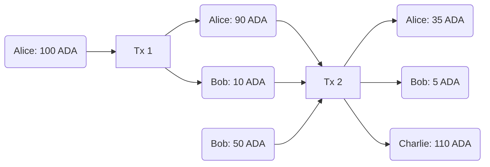
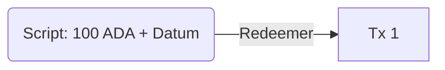

# Week 1

## Extended Unspent Transaction Output (EUTXO)

To pay 10 ADA to Bob, Alice will create a new transaction that consumes her unspent transaction output (from a previous transaction) of 100 ADA and creates 10 ADA for Bob and 90 ADA for Alice (which becomes her new UTXO).

UTXO:

* Inputs are unspent outputs (UTXOs) from previous transactions
* Output is specified by an *address* (a public key or its hash) and a *value* (ADA and other token amounts)

Extended UTXO:

* Output addresses are generalized and can contain Plutus script (*Validator*)
* Outputs can carry arbitrary data called *Datum* in addition to addresses and values
* *Redeemer* is an arbitrary data provided by the transaction for every input

Plutus script doesn't have access to the whole state of the blockchain (as in Ethereum), but it has access to:

* Datum
* Redeemer
* Context (transaction inputs and outputs, and other information)

* *Producing* transaction has to provide only a hash
* *Spending* transaction has to provide a validator (Plutus script)

When a node receives a transaction it validates it before accepting to the mempool ^[A pool of pending transactions], and if any input contains Plutus script, it is executed. 

* If Plutus script (*Validator*) fails, the transaction also fails.
* If some inputs (UTXO) are already consumed, the transaction fails **without** incurring fees.

## Plutus

Plutus Core - the language of the Plutus script. The code itself is written in Haskell and compiled to Plutus Core ^[At some point other languages might be supported as well that will compile to Plutus Core].

* Plutus Core is the **on-chain** part, which runs on the blockchain and validates the transaction.
* The Plutus Application Framework (PAF) is the **off-chain** part running in the user's wallet that builds and submits transactions.
